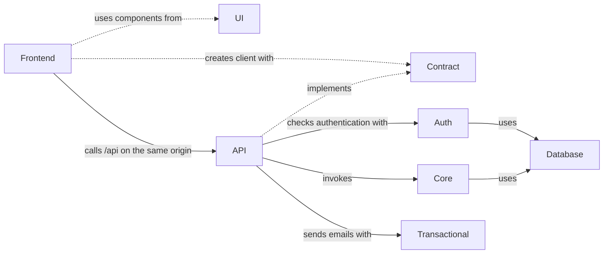
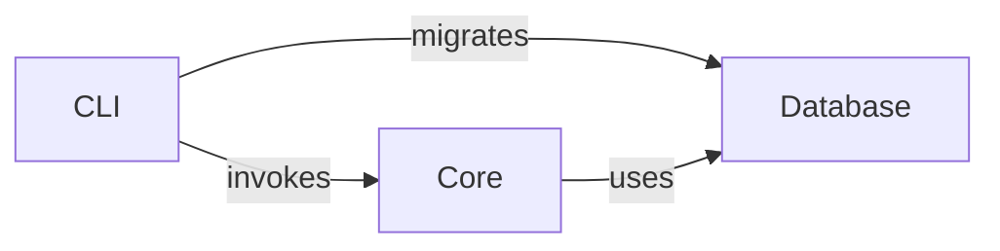
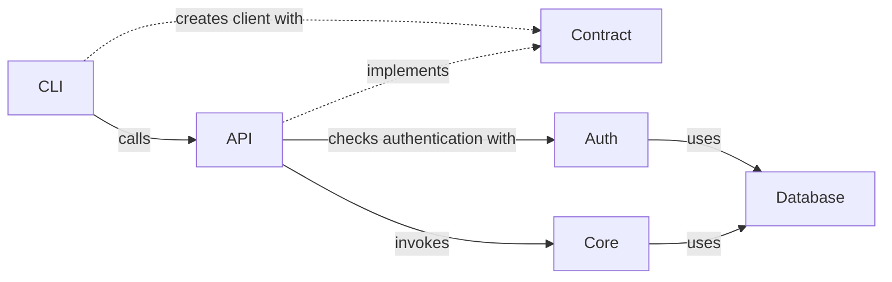

# Template for a monorepo

A pnpm + Turborepo starter: Hono API, Vite/React frontend, Commander
CLI, better-auth, Drizzle + PostgreSQL, oRPC contracts, TanStack Router +
Query, React Aria Components, Tailwind, Storybook, React Email, Vitest and
Playwright.

## Prerequisites

- Node.js 24 (see `.nvmrc`, `engines` in `package.json`)
- pnpm 12 (`corepack enable` picks the version from `packageManager`)
- Docker with Docker Compose (PostgreSQL and Mailpit)

## Using this template

1. Clone it (or click "Use this template" on GitHub):
   ```bash
   git clone https://github.com/ghdoergeloh/mono-repo-template my-app
   cd my-app
   ```
2. Rename the `@repo` workspace namespace to something project-specific.
   `@repo` appears in `package.json` files, tsconfig extends, lint
   configs, imports, and a handful of docs. One sweep handles all of it:
   ```bash
   git grep -l '@repo' | xargs sed -i '' 's|@repo|@myapp|g'   # macOS
   git grep -l '@repo' | xargs sed -i     's|@repo|@myapp|g'   # Linux
   ```
   Also change the project and container names in `compose.yml`.
3. Copy `.env.example` to `.env` and adjust.
4. `docker compose up -d` to bring up PostgreSQL + Mailpit.
5. `pnpm install && pnpm db:migrate && pnpm dev`.
6. Remove the example (see below) and write down the first decisions in
   `docs/`.

The app runs on http://localhost:5173: Vite serves the SPA and forwards
`/api` to the API on port 3000, so the browser sees one origin, like in
production. The Mailpit inbox is on http://localhost:8025.

### The example

The template ships one small feature that goes through every layer, as a
pattern to copy: a greeting for the signed-in user. Remove it when your
first real feature exists:

- `packages/core/src/services/greeting.service.ts` and its test
- `user.hello` in `packages/contract/src/index.ts`,
  `packages/core/src/handlers/user.ts` and `apps/api/src/router.ts`, and
  its tests in `handlers/user.spec.ts` and `apps/api/src/router.spec.ts`
- the `hello` command in `apps/cli/src/program.ts` and its test
- the greeting on `apps/react/src/routes/index.tsx`,
  `apps/react/src/routes/about.tsx`, and in `apps/e2e`: the greeting
  checks in `tests/auth.e2e.ts`, the `about` entry in
  `tests/screens.e2e.ts` and the home and about screenshots
  (`pnpm test:e2e --update-snapshots`)

Sign-up, sign-in and `user.me` are not an example; keep them.

## Commands

```bash
# Development
pnpm dev                          # All apps and packages in watch mode
pnpm -F @repo/api dev             # Only the API
pnpm -F @repo/react dev           # Only the React frontend
pnpm storybook                    # The UI components on http://localhost:6006

# Quality checks (CI runs all of them)
pnpm format                       # Check formatting with Oxfmt (format:fix writes)
pnpm lint                         # Oxlint, type-aware (lint:fix fixes)
pnpm typecheck                    # TypeScript, no build needed
pnpm test:unit                    # Vitest (test:unit:coverage with coverage)
pnpm test:e2e                     # Playwright against API, SPA and a fresh database
pnpm build                        # Build all workspaces
pnpm knip                         # Unused files, dependencies, exports
pnpm depcruise                    # Circular imports and package boundaries
pnpm crap                         # CRAP score report (after coverage run)

# Database (reads DATABASE_URL from .env)
pnpm db:generate                  # Generate a migration from the schema
pnpm db:migrate                   # Apply the migrations
pnpm db:push                      # Push the schema without a migration (experiments only)
pnpm db:studio                    # Open Drizzle Studio
pnpm -F @repo/auth generate       # Regenerate the better-auth tables

# Scaffolding
pnpm turbo gen init               # New package, with tests
pnpm -F @repo/ui ui-add <name>    # New React Aria component (shadcn CLI)
pnpm preview:emails               # Preview the email templates
```

## Architecture

### Project Structure

```plaintext
├── apps
│   ├── api             -> REST API with Hono, implements the contract, serves the SPA
│   ├── cli             -> CLI with Commander: core directly, migrations, or the API through the contract
│   ├── e2e             -> Playwright tests: flows, axe and screenshots of every screen
│   └── react           -> Frontend with Vite, React, TanStack Router and Query, uses the contract
├── packages
│   ├── auth            -> Authentication (better-auth), created by createAuth()
│   ├── contract        -> API contract (oRPC), implemented by the API, used as client in the frontend
│   ├── core            -> Business logic: services, and handlers that wire them to the contract
│   ├── db              -> Database connection, schema, migrations and test databases (Drizzle)
│   ├── transactional   -> Transactional emails (React Email, Nodemailer)
│   └── ui              -> UI components based on React Aria Components, with Storybook
├── tooling
│   ├── github          -> Shared GitHub Actions setup
│   ├── quality         -> Checks of the whole workspace, CRAP score script
│   ├── tailwind        -> Theme (design tokens, fonts) and PostCSS config
│   ├── typescript      -> Shared tsconfigs
│   └── vitest          -> Shared Vitest configs and the network guard
├── docs                -> Status, architecture and decisions of the project
├── turbo               -> Turborepo generators for new packages
├── .devcontainer       -> Sandboxed dev container for coding agents
├── compose.yml         -> Local services (PostgreSQL, Mailpit)
├── Dockerfile          -> One image: API, SPA and migrations
├── pnpm-workspace.yaml -> Workspaces and the dependency version catalogs
└── turbo.json
```

### Conventions

- All packages are ESM and use strict TypeScript (`tooling/typescript/base.json`).
  Workspace packages export their TypeScript sources, so typecheck and
  tests need no build.
- Dependency versions live in the catalogs in `pnpm-workspace.yaml`.
  `package.json` files reference them with `catalog:` or `catalog:react19`.
- Oxlint lints all packages with one root config (`.oxlintrc.json`),
  including type-aware rules. The React rules apply through an `overrides`
  entry: add new React workspaces to its `files` list.
- Oxfmt formats all files and sorts imports, Tailwind classes and
  `package.json` keys (`.oxfmtrc.json`).
- Commits follow Conventional Commits (commitlint + husky). lint-staged
  formats staged files.
- UI code uses the semantic tokens from `tooling/tailwind/theme.css`, not
  raw Tailwind palette colors, so theming and dark mode work everywhere.
- Packages export factories and read no environment on import. The API
  reads and checks it once (`apps/api/src/env.ts`).

### Adding an API endpoint

1. Define the route (schema, method, path) in `packages/contract/src/index.ts`.
2. Put the logic in a service in `packages/core/src/services/` and expose it
   through a handler in `packages/core/src/handlers/`.
3. Wire the handler into `apps/api/src/router.ts`. It needs a session
   unless you add it to `PUBLIC_PROCEDURES`.
4. The frontend and the CLI can call it right away with full type inference,
   e.g. `useQuery(orpc.user.hello.queryOptions())`.

### Flow

#### React frontend



#### Local CLI Application



#### Remote CLI Application



Hint: _CLI authentication requires the deviceAuthorization from better-auth._

## Testing

Most rules of the project are tests, not text. Each check is small and
names what is wrong.

| Check                              | Where                                           |
| ---------------------------------- | ----------------------------------------------- |
| No network in unit tests           | `tooling/vitest/no-network.ts`                  |
| Every package typechecks and tests | `tooling/quality/src/workspace.spec.ts`         |
| Fixed coverage floors              | `tooling/quality/src/vitest-configs.spec.ts`    |
| Every procedure needs a session    | `apps/api/src/router.spec.ts`                   |
| Package boundaries                 | `.dependency-cruiser.cjs`                       |
| Migrations match the schema        | CI                                              |
| Contrast of all token pairs        | `packages/ui/src/test/contrast.spec.ts`         |
| No raw colors                      | `packages/ui/src/test/raw-colors.spec.ts`       |
| Screens use `@repo/ui` only        | `apps/react/src/test/ui-only.spec.ts`           |
| Stories: axe and screenshots       | `packages/ui/src/test/stories.browser.test.tsx` |
| Screens: axe, width, screenshots   | `apps/e2e/tests/screens.e2e.ts`                 |
| Secrets, workflow security         | CI (gitleaks, actionlint, zizmor)               |

- **Database:** `createTestDatabase()` from `@repo/db/testing` gives each
  test a migrated in-memory PostgreSQL (PGlite). Tests of locks and
  parallel transactions use `createPostgresTestDatabase()` against a real
  server; they run when `TEST_DATABASE_URL` is set, as in CI.
- **Coverage floors** are fixed numbers a little below the measured
  values. Raise them by hand; they do not rewrite themselves.
- **Screenshots** of stories and screens are compared on Linux arm64,
  where the references come from: the CI runner `ubuntu-24.04-arm` and
  the dev container on Apple silicon. Other systems run every other check
  and skip only the pixel comparison. After an intended
  change: `pnpm -F @repo/ui exec vitest run --project stories --update`
  or `pnpm test:e2e --update-snapshots`, then look at every new image.
- Story tests need Chromium: `pnpm -F @repo/ui exec playwright install chromium`.

## Production

`docker build -t app .` builds one image with the API, the built SPA and
the CLI. The API serves the SPA and `/api` on one origin
(`docs/decisions/0001-*`), `/health` answers while the process runs,
`/ready` when the database answers. Migrations run from the same image:

```bash
docker run --rm -e DATABASE_URL=… app node apps/cli/dist/index.js migrate
```

The API needs `DATABASE_URL`, `BETTER_AUTH_SECRET` and `BETTER_AUTH_URL`
(the public origin). With `SMTP_HOST` and `SMTP_FROM`, new accounts must
verify their email address. `apps/api/src/env.ts` lists every variable.
